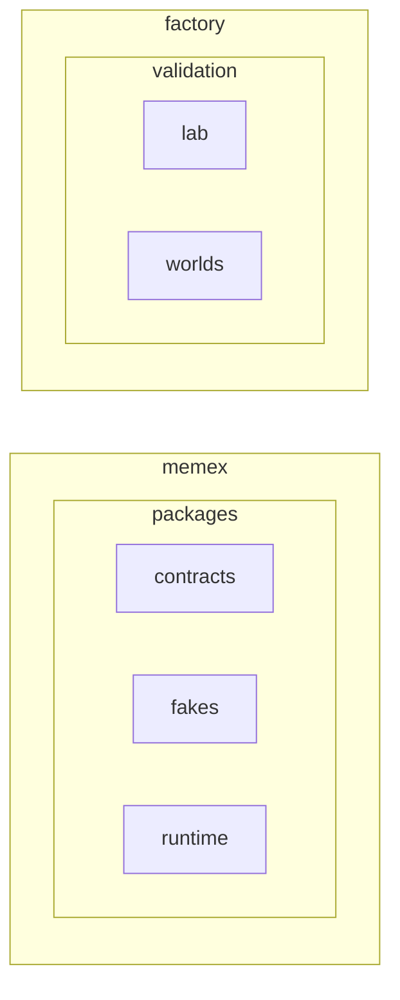

# Dependency graph

> Generated by `pnpm docs:generate`. Do not edit.

Dependencies between the packages.

```mermaid
flowchart LR

subgraph 0["factory"]
subgraph 1["validation"]
2["lab"]
3["worlds"]
end
end
subgraph 4["memex"]
subgraph 5["packages"]
6["contracts"]
7["fakes"]
8["runtime"]
end
end
```
